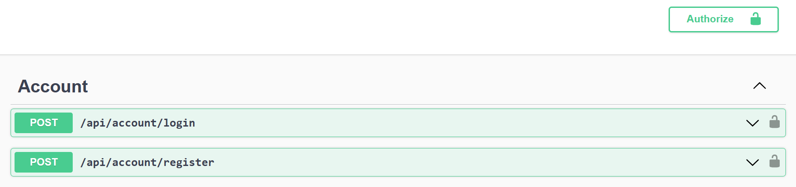
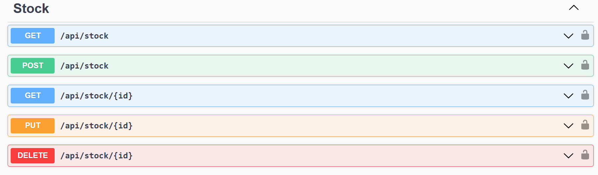
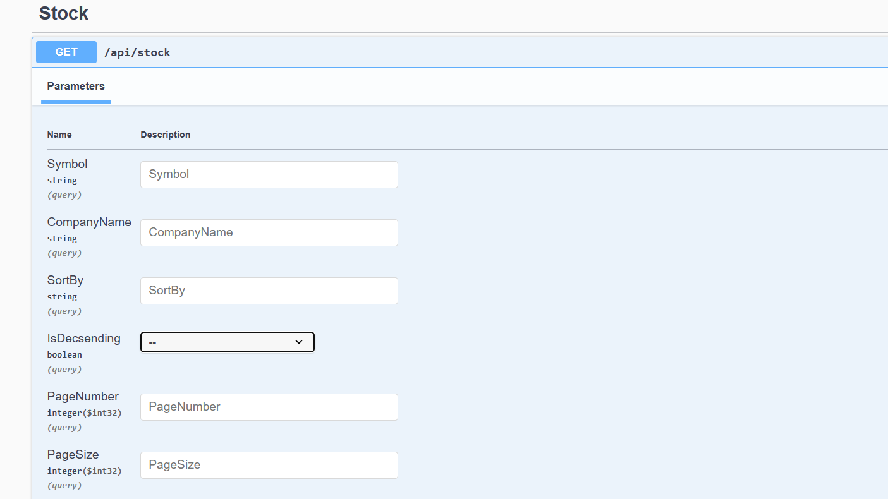
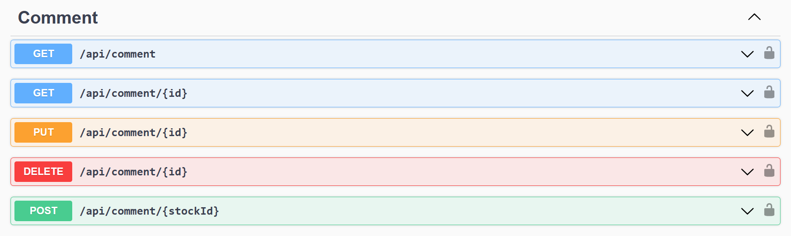
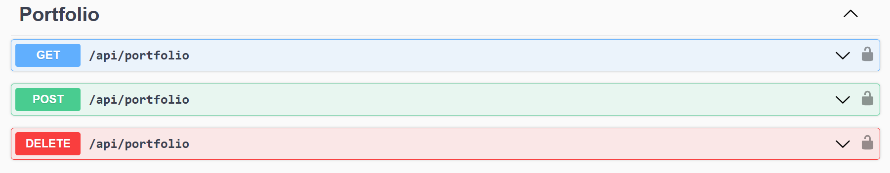

# 🏬 Stock Market Portfolio Web App

This repository contains the source code for a Stock Market Portfolio web application built using DotNet 8 and MS SQL Server. 

The project implements Clean Architecture, CQRS pattern, minimal api with api versioning, repository pattern (CRUD), pagination, sorting, custom JWT authorization(MS Security), it manages database relationships including one-to-one, many-to-many, and one-to-many relationships..

## 👷 Frameworks, Libraries and TechnologiesTechnologies Used

- .NET 8
- ASP.NET Core 8
- Entity Framework Core
- SQL Server 2022
- Swashbuckle
- Swagger UI
- NuGet Gallery

## 🚀 Quick start

### Clone the repository

```
git clone git@github.com:flavours/getting-started-with-spring-boot.git
```

### Build the project

```
cd api
dotnet ef migrations add <NAME>
dotnet ef databaseupdate
```

The project includes a ``web`` service, running the c# code, and a ``db`` service, running a MS SQL database.

### Run the project

```
dotnet watch run
````

The project can be reached at http://localhost:5231/swagger/index.html.


## 🔧 Implementation features

### 🪪 Authentication

Authentication is implemented using a JWT access token (MS Security)

AccessToken is used to authorize users.

#### 🔐 Login

Allows you to Register and login, Authorize using Token 



#### 📦 Stock

Functionality that allows to manage and interact with Stock
 (Token required, 🔒manager policy)



##### * 📈 Parameter

Functionality allows to manage the Stocks' Get_All (Choosing Symbol, Company Name, SortBy, IsDecsending, Page number, page size )



#### 📩 Comment

Functionality that allows to manage and interact with Comment
(Token required, 🔒manager policy)



#### 💼 Portfolio

Functionality that allows to manage and interact with Portfolio
(Token required, 🔒manager policy)



## ✍️ Authors

- [OshadhaViran](https://github.com/oviran)

## 📜 License

Distributed under the MIT License. See `LICENSE` for more information.

## 📞 Contact

Oshadha Viran - [@linkedin](https://www.linkedin.com/in/oshadha-viran-847b751a3/) - oviran@gmail.com


